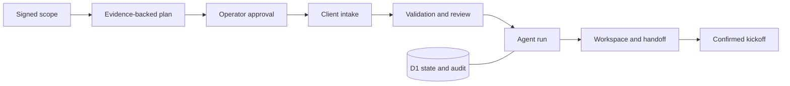

# Launchlane

**Turn signed scopes into verified, kickoff-ready client workspaces.**

Launchlane is a client-onboarding automation agent for service businesses. It coordinates the work between signing an agreement and starting delivery: requirements, client intake, review, provisioning, and handoff.

[](https://github.com/shrawangopal/launchlane/actions/workflows/ci.yml)

## What actually happens

1. An operator imports a scope and selects a supported service.
2. Launchlane proposes a playbook-backed checklist with exact evidence passages.
3. The operator approves the plan; the client supplies inputs through a private intake link.
4. Format checks run immediately. The operator accepts content or requests corrections.
5. The agent creates workspace records, a reviewed-input handoff, and a task manifest.
6. Once all prerequisites are accepted, the operator confirms kickoff and exports a calendar file.
7. A local delivery tool can turn the exported package into actual folders and files.

**This is a working bounded automation agent, not a chatbot.** Version 0.1 uses deterministic transitions and BM25 evidence retrieval, with no model API key required. It does not use an LLM or claim to understand every clause in an arbitrary contract.

## Features

- Three service playbooks: website projects, brand identity, and software implementation.
- Persistent operator workspaces backed by Cloudflare D1.
- Scope import from pasted text or `.txt` / `.md` files.
- Evidence search across the scope and versioned playbook corpus.
- Client submission portal, secret-pattern checks, and a correction/review loop.
- Plan approval and kickoff gates enforced on the server.
- Optimistic concurrency: stale sessions cannot overwrite newer decisions.
- Stable artifact IDs: repeated agent runs do not duplicate resources.
- Activity history with actor, timestamp, action, and outcome.
- Handoff, task, welcome-message, and ICS exports.
- A filesystem materializer that refuses existing destinations and overwrites.
- A read-only WebMCP tool for inspecting the signed-in user's launches.

## Run locally

Requires **Node.js 24** and npm. No paid API account is needed for the local demo.

```sh
git clone https://github.com/shrawangopal/launchlane.git
cd launchlane
npm ci
npm run build
npm run db:local
npm run dev
```

Open the local address printed by the server (normally `http://localhost:5173`). Choose **Sign in to Launchlane** to use the loopback-only development identity, then **Load guided demo**.

The local database is stored under ignored `.wrangler/state`. `db:local` uses local-only migrations; it does not access a production database. Hosted authentication is provided by the Sites gateway. Never expose the local mock-auth server publicly.

If the Windows npm shim is broken, invoke npm's JavaScript entrypoint with your installed Node runtime, or run the project scripts directly with `node scripts/run-framework.mjs build` and `node scripts/run-framework.mjs dev`.

## Demonstrate the complete workflow

Start with **Orbit Analytics** to approve a new plan, **Northstar Studio** to review incomplete inputs, or **Forma Collective** to generate a kickoff event from accepted inputs. See the [guided demo](docs/DEMO.md).

To create real files from an exported package:

```sh
node scripts/materialize.mjs client-workspace.json ./new-client-workspace
```

The destination must be new. No existing files are deleted or overwritten.

## Verify

```sh
npm test
npm run typecheck
npm run evaluate
npm run test:integration  # local dev server must already be running
```

- Unit tests cover approval gates, correction flows, stale handoffs, duplicate provisioning, unsafe inputs, calendar escaping, and safe filenames.
- Integration tests exercise authentication, forged identity headers, cross-origin rejection, revision conflicts, intake-only authorization, persistence, and the full kickoff flow.
- The retrieval evaluation is a small hand-authored smoke set, not evidence of real-world accuracy or customer savings.
- Integration tests create a retained test project and never delete it.

## Architecture

React + TypeScript · Vinext/Vite · Cloudflare Workers + D1 · Drizzle migrations · Zod · Radix/Shadcn · Node test runner.



Read the [architecture](docs/ARCHITECTURE.md), [security model](SECURITY.md), and [integration boundary](docs/INTEGRATIONS.md).

## Honest product boundaries

This is a functional v0.1 and pilot foundation. Workspace folders are records inside Launchlane until exported/materialized. Welcome messages and calendar files are **not sent automatically**. No external drive, CRM, email service, or calendar account is connected. Asset URLs require human verification. PDF/OCR import and unrestricted contract extraction are not included.

The hosted demonstration is owner-private. A commercial customer deployment needs an appropriate external-client authentication/access path, revocable intake links, team membership, quotas, backups, and the customer's chosen live connector. These are explicitly documented rather than represented by fake connected buttons.

## Commercial direction

Start with one service business, configure its onboarding checklist, and measure time from signed scope to accepted handoff and operator effort per launch. The [pilot guide](docs/PILOT.md) provides an initial offer, acceptance criteria, and measurement plan. No revenue or savings claims have been validated.

## Source publication

Original Launchlane code is published for portfolio review with rights reserved; no open-source license is granted by default. Contact the repository owner for commercial permission. Third-party starter code and dependencies retain their own licenses. See [LICENSE](LICENSE) and [third-party notices](THIRD_PARTY_NOTICES.md).
