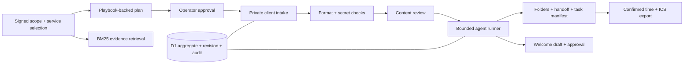

# Architecture

Launchlane is a bounded, evidence-backed automation agent. Version 0.1 uses deterministic workflow transitions and BM25 lexical retrieval. It does not call an LLM, embed documents, or claim unrestricted contract understanding. It needs no model API key to run.

## Boundaries

- `lib/domain.ts`: pure domain types, validation, policy corpus, retrieval, state transitions, calendar generation. Inputs are cloned; failed transitions never change the persisted project.
- `db/store.ts`: prepared D1 statements and compare-and-swap persistence. Every write includes the prior revision and owner. A stale concurrent write returns 409 rather than losing another user's update.
- `lib/api.ts`: validated command schemas, authenticated operator identity, same-origin checks, and error responses.
- `app/api/projects`: owner-scoped project operations.
- `app/api/portal`: high-entropy bearer-link intake. Only the submission command is permitted, and scope, audit history, message drafts, and token are excluded from responses.
- `app/api/evidence`: retrieves exact passages from the selected owner's scope and checked-in playbooks. No source text becomes an executable instruction.
- `scripts/materialize.mjs`: turns an exported package into a new local directory. It refuses unsafe filenames, duplicate names, existing destinations, and overwrites.

## Lifecycle

Plan review → collecting inputs → ready for kickoff → kickoff confirmed.

All four required inputs must be accepted, the plan must be approved, and the handoff must reflect current inputs. Changing an accepted input invalidates readiness. Human-review inputs return to review on resubmission. The agent does not follow supplied URLs; an operator verifies access and content. Email format validation does not verify mailbox ownership.

The runner uses stable artifact and message IDs. Running it twice does not create duplicate folders, messages, or calendar events. Each run still adds an audit event, making repeated attempts visible. Optimistic concurrency protects the entire aggregate in one database update, including artifacts and audit history.

## Persistence tradeoff

One project is stored as a JSON aggregate plus indexed owner, portal hash, creation time, and revision columns. This keeps state and audit updates atomic and makes the first version easy to inspect. It is appropriate for small onboarding projects, not unbounded histories. The list endpoint returns at most 100 projects. A larger deployment should separate searchable entities, add pagination and quotas, and choose an explicit audit retention policy.

The audit trail is append-only through application commands, but it is not cryptographically tamper-evident and database administrators can modify it. Do not sell it as an immutable compliance ledger.

## Agent versus RAG

This project satisfies the **automation agent** direction. Retrieval supports evidence inspection. The planner selects a service playbook and surfaces a scope/service mismatch; it does not infer every obligation in an arbitrary agreement. A model-assisted extraction stage would require a separate evaluation set, exact citation validation, and operator approval before it could add requirements. Tool execution should remain deterministic even if that stage is added.
